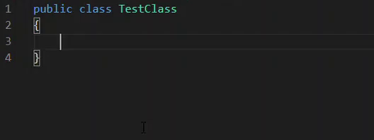

# XUnit Snippets

Snippet support for common XUnit code (facts, test class,...)

## Features

Supported languages: C#, (F# planned)

Supported snippets include
  - `xclass`: Test class 
  - `xfact`: Fact test method
  - `xtheory`: Theory test method 
  - `xdatafield`: TheoryData as a field
  - `xdatam`: TheoryData from a method 

In general, the snippets will tab through (in order)
- Type definitions
- Class/Method names
- End with the cursor where you write code
  - If there is default code, it will be replaced when you start typing

<!-- <video>
    <source>readme-content/Fact.mp4</source>
</video> -->

## Release Notes

### 1.0.0

Initial release with basic snippets for C# (fact, theory, test class, test data)

-----------------------------------------------------------------
